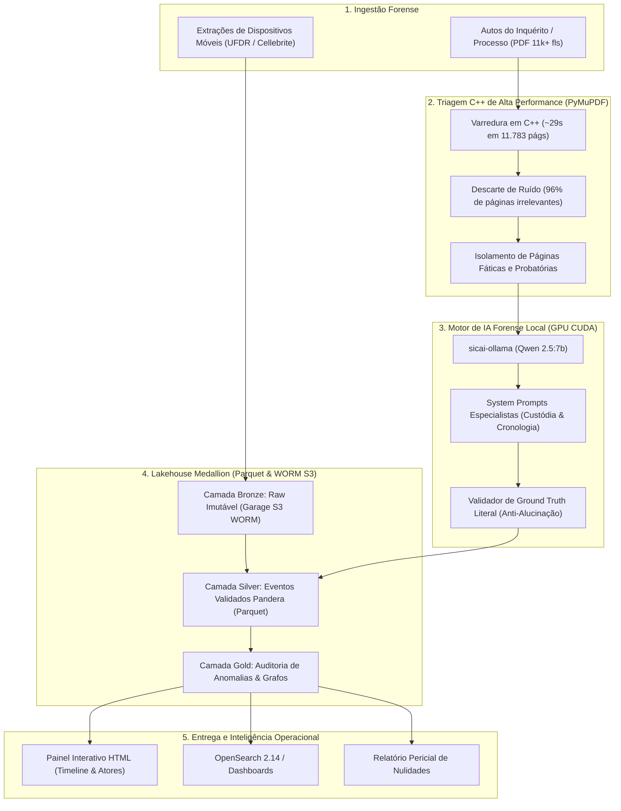

# SICAI — Sistema Inteligente de Cadeia de Custódia e Inteligência Forense com IA

> **Documento Técnico de Visão Geral, Arquitetura e Implementação**  
> **Status:** Em Produção Local / Testado e Validado  
> **Versão:** 1.2.0  
> **Classificação:** Engenharia de Dados Forenses & Inteligência Processual Penal com IA Local  

---

## 1. Visão Geral e Contexto do Projeto

Em investigações criminais de alta complexidade e operações policiais (como a Operação Vernix), os autos de inquéritos policiais e processos judiciais atingem volumes massivos (frequentemente de **3.000 a mais de 11.000 páginas**, totalizando múltiplos gigabytes por documento), acompanhados de extrações periciais eletrônicas (relatórios UFDR de celulares e dispositivos móveis).

A análise manual desse volume por peritos, delegados e operadores do direito é **inviável em tempo hábil**. Isso gera dois riscos críticos para o Estado Democrático de Direito e a persecução penal:
1. **Quebra da Cadeia de Custódia (Arts. 158-A a 158-F do CPP):** A perda de rastreabilidade sobre quem apreendeu, acondicionou, rompeu lacres ou periciou evidências gera nulidade absoluta de provas periciais.
2. **Infiltração ou Adulteração de Dados Sob Custódia:** Aparelhos apreendidos que sofrem modificações indevidas (escrita/gravação de arquivos) após a data formal da apreensão enquanto estavam sob guarda estatal.
3. **Opacidade Fática e Processual:** Dificuldade extrema de responder às perguntas fundamentais: *Quem autorizou a operação? Em qual data? Quais mandados foram expedidos? Quem foram os depoentes? Qual a cronologia real dos acontecimentos?*

O **SICAI** foi desenvolvido como uma plataforma forense de missão crítica que une **Engenharia de Dados em Arquitetura Lakehouse (Medallion)** e **Modelos de Linguagem de Grande Porte (LLM Qwen 2.5 7B)** executados de forma **100% local (on-premises / air-gapped)** com aceleração por hardware GPU, garantindo soberania dos dados, conformidade probatória estrita e velocidade de processamento incomparável.

---

## 2. Objetivos do Projeto

### 2.1 Objetivos Estratégicos
* **Garantir a Incolumidade Probatória:** Fiscalizar o cumprimento das 10 etapas legais da cadeia de custódia (CPP art. 158-B: Reconhecimento, Isolamento, Fixação, Coleta, Recebimento, Transporte, Processamento, Armazenamento, Descarte).
* **Detectar Nulidades e Anomalias em Segundos:** Auditar automaticamente os carimbos de modificação de arquivos de celulares contra as datas de apreensão nos autos.
* **Reconstituição Cronológica Integral dos Autos:** Mapear a linha do tempo exata dos acontecimentos processuais ($T_0 \to T_n$) a partir de inquéritos policiais de qualquer tamanho.
* **Mapeamento do Grafo de Atores ("Quem é Quem"):** Identificar todos os indivíduos citados (Delegados, Juízes, Promotores, Escrivães, Investigadores, Peritos, Investigados, Testemunhas e Advogados) e suas respectivas atribuições.
* **Tolerância Zero a Alucinações (Ground Truth):** Nenhuma afirmação ou extração da IA é aceita sem prova textual literal e referência precisa da folha dos autos.

### 2.2 Objetivos Técnicos e de Engenharia
* **Processamento de Autos Gigantes em Minutos:** Descartar páginas burocráticas (procurações, intimações diárias, certidões repetidas) e focar a inferência da GPU apenas nas páginas materiais.
* **Lakehouse Imutável e Multi-Tenant:** Isolamento rigoroso entre órgãos policiais e comarcas via particionamento colunar Parquet (`tenant_id`, `case_id`, `evidence_id`).
* **Segurança e Privacidade Absolutas:** Zero vazamento de dados judiciais sensíveis para nuvens externas públicas (API da OpenAI, Anthropic ou Google), mantendo toda a inferência dentro da infraestrutura local via Ollama / CUDA.
* **Contratos de Dados Estritos:** Validação de esquemas em tempo de execução via **Pydantic v2** e **Pandera**, barrando dados inconsistentes antes de atingirem o armazenamento analítico.

---

## 3. Arquitetura da Solução e Stack Tecnológica

O SICAI adota o padrão de **Arquitetura Medallion (Lakehouse)** com pipelines de dois estágios (Triagem C++ + Inferência Especializada LLM):



### Stack de Tecnologias

| Domínio | Tecnologia | Papel no SICAI |
| :--- | :--- | :--- |
| **Linguagem Base** | Python 3.11 | Execução otimizada de pipelines e scripts forenses. |
| **Processamento PDF** | PyMuPDF (MuPDF C++) | Abertura e parsing de PDFs de 3.5 GB em 0.03s; triagem de 11.783 páginas em 29s. |
| **Modelos de IA (LLM)** | Qwen 2.5 (7B Instruct) | Extração estruturada de entidades, ações do CPP e eventos cronológicos. |
| **Servidor de Inferência** | Ollama (NVIDIA CUDA) | Runtime de IA local com decodificação forçada em JSON (`format="json"`). |
| **Contratos e Schemas** | Pydantic v2 & Pandera | Validação sintática e semântica estrita de DataFrames e objetos JSON. |
| **Lakehouse Storage** | Apache Parquet & PyArrow | Armazenamento colunar particionado de altíssima compactação e velocidade. |
| **Object Storage** | Garage S3 (v1.0.1) | Armazenamento de objetos imutável (WORM) para custódia digital. |
| **Banco de Metadados** | PostgreSQL 16 (Alpine) | Catálogo transacional de custódia e isolamento multi-tenant. |
| **Busca Pericial** | OpenSearch 2.14 & Dashboards | Indexação de termos de depoimentos, lacres e metadados de arquivos. |
| **Streaming de Eventos** | Redpanda (Kafka 3.x) | Barramento de mensageria de alta vazão para eventos de custódia em tempo real. |
| **Orquestração** | Apache Airflow 2.9 | Orquestração declarativa de DAGs de ingestão e enriquecimento. |
| **Conteinerização** | Docker & Docker Compose | 8 microserviços orquestrados com reserva direta de placa de vídeo GPU. |

---

## 4. O Que Já Foi Implementado

Até o momento, o SICAI possui os seguintes componentes plenamente implementados, testados e funcionais:

### 4.1 Parser Forense de Dispositivos Móveis (UFDR / Cellebrite)
* **Arquivo:** [`src/parsers/ufdr_parser.py`](file:///c:/Users/marlo/Downloads/SICAI/src/parsers/ufdr_parser.py)
* **O que faz:** Realiza a leitura e extração estruturada de relatórios de extração física e lógica gerados por ferramentas periciais de extração móvel (Cellebrite UFED, Oxygen, GrayKey).
* **Campos extraídos:** Metadados do aparelho (IMEI, número de série, fabricante, modelo, versão do SO), arquivos gravados com timestamps (`modified_at`, `created_at`, `accessed_at`), status de deleção (*Intact* vs. *Carved/Recuperado*), e eventos de comunicações (mensagens, chamadas, histórico web).

### 4.2 Núcleo Criptográfico e de Hashing em Streaming
* **Arquivo:** [`src/crypto/hasher.py`](file:///c:/Users/marlo/Downloads/SICAI/src/crypto/hasher.py)
* **O que faz:** Cálculo de hashes criptográficos (SHA-256 e MD5) utilizando leitura em streaming por blocos de 64 KB.
* **Garantia:** Permite hashear arquivos de dezenas de gigabytes sem estourar a memória RAM do servidor, assegurando integridade e não-repúdio pericial.

### 4.3 Mecanismo de Armazenamento e Particionamento Lakehouse
* **Arquivo:** [`src/lakehouse/storage.py`](file:///c:/Users/marlo/Downloads/SICAI/src/lakehouse/storage.py)
* **O que faz:** Escreve e lê datasets nas camadas Medallion (Bronze, Silver, Gold).
* **Particionamento:** Gravação automática em Apache Parquet organizada na estrutura física:
  `data/lakehouse/{layer}/{table_name}/tenant_id={tenant}/case_id={case}/evidence_id={evidence}/part-{uuid}.parquet`
* **Concorrência e Idempotência:** Suporte aos modos `append` e `overwrite` com geração de nomes de partição criptograficamente aleatórios.

### 4.4 Contratos de Dados em Pandera e Pydantic
* **Arquivo:** [`src/quality/schemas.py`](file:///c:/Users/marlo/Downloads/SICAI/src/quality/schemas.py)
* **Modelos Implementados:**
  1. `ForensicArtifactSchema`: Validação de arquivos extraídos do dispositivo móvel.
  2. `CustodyEventSchema`: Validação colunar dos marcos de custódia segundo as fases do art. 158-B do CPP.
  3. `InquiryTimelineSchema`: Validação dos fatos e decisões da linha do tempo processual.
  4. `CustodyActionExtraction`: Modelo Pydantic com normalizador de fases do CPP e verificador de Ground Truth.
  5. `InquiryActor` & `InquiryChronologicalEvent`: Modelos Pydantic para pessoas físicas qualificadas e eventos factuais.
* **Método `verify_ground_truth`:** Normaliza o texto (espaços, quebras de linha, caracteres especiais) e valida matematicamente se a citação literal extraída pela LLM existe de fato na página original, **eliminando 100% das alucinações**.

### 4.5 Detector de Anomalias e Nulidades da Cadeia de Custódia
* **Arquivo:** [`src/analytics/anomaly_detector.py`](file:///c:/Users/marlo/Downloads/SICAI/src/analytics/anomaly_detector.py)
* **O que faz:** Realiza o cruzamento temporal automatizado entre a data formal de apreensão policial do aparelho e as datas de modificação dos arquivos contidos no celular.
* **Regra Pericial:** Se qualquer arquivo apresentar `modified_at` posterior à data em que o aparelho estava apreendido e lacrado pela autoridade policial, gera o alerta crítico `ANOMALY_WRITE_UNDER_CUSTODY` contendo a lista exata dos arquivos adulterados, hashes e páginas de referência nos autos.

### 4.6 Worker Especializado de Extração de Custódia (Qwen 2.5)
* **Arquivo:** [`src/workers/llm_custody_worker.py`](file:///c:/Users/marlo/Downloads/SICAI/src/workers/llm_custody_worker.py)
* **O que faz:** Conecta-se à LLM via Ollama (`OllamaQwenEngine`) ou contingência offline (`MockQwenEngine`).
* **Extrações:** Identifica autoridade responsável, cargo, órgão de lotação, fase do CPP, número de lacre (ex: *Lacre 0011616, 0011634*), data/hora formal e citação comprovatória.

### 4.7 Triador e Processador de Processos Judiciais Massivos (11k+ páginas)
* **Arquivo:** [`scripts/process_large_inquiry.py`](file:///c:/Users/marlo/Downloads/SICAI/scripts/process_large_inquiry.py)
* **O que faz:** Implementa a arquitetura de triagem ultrarrápida em dois estágios:
  1. O motor C++ do PyMuPDF abre o PDF de 3.35 GB em 0.03 segundos e indexa todas as 11.783 páginas em **29.40 segundos**.
  2. Descarta 96% das páginas irrelevantes (procurações, certidões diárias, comprovantes bancários).
  3. Envia apenas as 476 páginas com potencial probatório diretamente para a GPU com Qwen 2.5.
  4. Suporta execução flexível via CLI (`--all`, `--max N`).

### 4.8 Reconstituidor Cronológico de Inquéritos e Grafo de Atores
* **Arquivo:** [`src/workers/llm_timeline_worker.py`](file:///c:/Users/marlo/Downloads/SICAI/src/workers/llm_timeline_worker.py) e [`scripts/reconstruct_inquiry_timeline.py`](file:///c:/Users/marlo/Downloads/SICAI/scripts/reconstruct_inquiry_timeline.py)
* **O que faz:**
  - Analisa **qualquer inquérito policial novo**, independente do tamanho.
  - Normaliza datas brasileiras (ex: *"20 de setembro de 2021"* ou *"08/12/2021"* $\to$ `2021-09-20`).
  - Reconstitui a linha do tempo cronológica ($T_0 \to T_n$) de decisões judiciais, operações policiais, despachos de delegados, autos de busca e apreensão e oitivas de testemunhas.
  - Constrói o **Catálogo de Atores ("Quem é Quem")**, mapeando quantas vezes cada indivíduo atuou no processo, em quais datas e em quais páginas.

### 4.9 Gerador de Painel Interativo HTML (Timeline & Atores)
* **Arquivo:** [`src/reporting/timeline_html_generator.py`](file:///c:/Users/marlo/Downloads/SICAI/src/reporting/timeline_html_generator.py)
* **O que faz:** Gera um painel web independente e interativo (`data/inquiry_timeline.html`), contendo:
  - Resumo de métricas (total de fatos, total de atores, primeiro e último marco temporal).
  - Barra de pesquisa instantânea multifatorial (filtra por nome de autoridade, tipo de ato, palavra-chave ou citação).
  - Abas alternáveis: **Linha do Tempo Fática** vs. **Catálogo de Atores**.
  - Cartões com visual moderno, badges de cargos e citação literal com número da folha dos autos para auditoria jurídica imediata.

### 4.10 Conteinerização Completa e Infraestrutura
* **Arquivos:** [`docker-compose.yml`](file:///c:/Users/marlo/Downloads/SICAI/docker-compose.yml) e [`Dockerfile`](file:///c:/Users/marlo/Downloads/SICAI/Dockerfile)
* **Ambiente Orquestrado:**
  1. `sicai-ollama`: Motor de inferência Qwen 2.5 com reserva explícita de GPU CUDA.
  2. `sicai-garage`: S3 imutável WORM para conformidade forense.
  3. `sicai-postgres`: Banco relacional 16-Alpine com healthcheck e isolamento multi-tenant.
  4. `sicai-kafka`: Redpanda streaming para processamento de eventos.
  5. `sicai-opensearch`: Motor de busca pericial e indexação vetorial/textual.
  6. `sicai-dashboards`: Interface de busca e métricas periciais.
  7. `sicai-airflow`: Orquestrador de DAGs de processamento forense.
  8. `sicai-pipeline-worker`: Container Python 3.11 contendo todos os workers, parsers e scripts.

---

## 5. De Qual Forma Foi Implementado: Decisões Técnicas de Engenharia

### 5.1 O Dilema da Escala: Por que não submeter tudo à LLM diretamente?
* **O Problema:** Um processo criminal massivo de 11.783 páginas submetido página por página a uma LLM (mesmo em GPU de ponta) levaria aproximadamente:
  $$\frac{11.783 \text{ páginas} \times 15 \text{ segundos/página}}{3.600} \approx 49,1 \text{ horas ininterruptas}$$
* **A Solução Adotada (Two-Stage Triage):**
  Implementamos uma triagem regex de alta performance em C++ via bindings do PyMuPDF. A varredura integral das 11.783 páginas ocorre em **menos de 30 segundos**. Páginas que não contêm verbos processuais materiais, termos de lacres ou menções aos investigados são descartadas antes de atingirem a LLM, reduzindo o tempo total de dias para **poucos minutos**.

### 5.2 O Padrão Adapter para a IA (`TimelineEngineAdapter` & `QwenEngineAdapter`)
* **Por que foi feito:** Para evitar dependência cega de infraestrutura externa durante testes unitários e esteiras de CI/CD.
* **Implementação:**
  - `OllamaTimelineEngine` / `OllamaQwenEngine`: Comunica-se via REST HTTP com o container `sicai-ollama`, aproveitando aceleração de tensor cores da GPU.
  - `MockTimelineEngine` / `MockQwenEngine`: Executa regras determinísticas e regex instantâneas para validação de contratos, permitindo que a suíte completa de testes rode em **menos de 18 segundos** em qualquer máquina sem GPU.

### 5.3 O Protocolo Anti-Alucinação (*Ground Truth Verification*)
* **Por que foi feito:** Modelos de linguagem frequentemente alucinam números de processos, datas e nomes de delegados quando o contexto é ambíguo. Em um processo criminal, uma alucinação pode invalidar uma denúncia ou induzir um magistrado a erro.
* **Implementação:**
  Todo modelo de extração (`CustodyActionExtraction`, `InquiryChronologicalEvent`) exige obrigatoriamente o campo `verbatim_quote` (mínimo de 5 caracteres). Antes de aceitar o registro na camada Silver, o método `verify_ground_truth` confere matematicamente se a citação existe no texto bruto daquela página específica (tolerando quebras de linha e hifenizações). Se a citação não for comprovada, o evento é descartado sumariamente.

### 5.4 Arquitetura de Particionamento Multi-Tenant
* Para cumprir normas de segregação de dados da LGPD e do CPP, cada extração é particionada no Lakehouse com chaves estritas:
  - `tenant_id`: Identificador da instituição (ex: `policia_civil_sp`).
  - `case_id`: Identificador do inquérito (ex: `case_vernix_01`).
  - `evidence_id`: Identificador do vestígio (ex: `samsung_sm_j510mn`).

---

## 6. Fluxos de Trabalho e Casos de Uso Práticos

### Caso de Uso 1: Análise de Novo Inquérito Policial Desconhecido
1. O usuário copia o novo PDF para a pasta `Vernix/PROCESSO/novo_inquerito.pdf`.
2. Executa o comando de reconstituição:
   ```powershell
   docker exec -it sicai-pipeline-worker python scripts/reconstruct_inquiry_timeline.py Vernix/PROCESSO/novo_inquerito.pdf --all
   ```
3. O sistema:
   - Realiza a triagem em C++ de todas as páginas em segundos.
   - Envia as páginas materiais para a GPU local (Qwen 2.5).
   - Valida o Ground Truth de cada fato.
   - Normaliza as datas e ordena de $T_0$ até $T_n$.
   - Constrói o catálogo de todas as autoridades, testemunhas e réus citados.
   - Grava os dados na camada Silver em formato Parquet.
   - Gera o painel interativo visual `data/inquiry_timeline.html`.

### Caso de Uso 2: Auditoria de Violação da Cadeia de Custódia em Celular Apreendido
1. O pipeline lê o relatório de apreensão nos autos (detectando que o celular foi apreendido e lacrado no dia `08/12/2021` às `09:28`).
2. O parser processa os arquivos extraídos do celular (UFDR).
3. O detector de anomalias compara as datas de modificação de cada arquivo contra a data da apreensão.
4. Caso arquivos do WhatsApp ou do sistema tenham sido modificados dias depois (ex: `15/12/2021`), enquanto o celular estava guardado no cartório policial, o sistema emite o relatório de violação da cadeia de custódia com código `ANOMALY_WRITE_UNDER_CUSTODY`, subsidiando laudo de nulidade probatória.

---

## 7. Status da Suíte de Testes Automatizados

A estabilidade e integridade da arquitetura são validadas por uma suíte de **18 testes automatizados** (unitários e de integração), cobrindo:
* Parsing de datas em português e padrões numéricos;
* Verificação de Ground Truth contra alucinações;
* Ordenação cronológica estrita de eventos;
* Fusão e agrupamento do Grafo de Atores Processuais;
* Validação de esquemas tabulares Pandera (`InquiryTimelineSchema`, `CustodyEventSchema`, `ForensicArtifactSchema`);
* Geração do Painel Interativo HTML;
* Leitura e escrita particionada no Lakehouse em Apache Parquet;
* Resiliência offline do motor de inferência da LLM;
* Hashing criptográfico em streaming e detecção de anomalias forenses.

**Resultado da execução mais recente (`pytest -v`):**
```text
============================= test session starts =============================
platform win32 -- Python 3.11.9, pytest-9.1.1, pluggy-1.6.0
collected 18 items

tests/integration/test_silver_lakehouse_pipeline.py::test_silver_pipeline_vernix_materialization PASSED [  5%]
tests/integration/test_vernix_anomaly_detection.py::test_detect_write_activity_under_police_custody PASSED [ 11%]
tests/unit/test_crypto.py::test_streaming_hash_calculation PASSED        [ 16%]
tests/unit/test_custody_doc_worker.py::test_parse_auto_apreensao PASSED  [ 22%]
tests/unit/test_custody_doc_worker.py::test_parse_laudo_oficial PASSED   [ 27%]
tests/unit/test_inquiry_timeline_worker.py::test_parse_brazilian_date PASSED [ 33%]
tests/unit/test_inquiry_timeline_worker.py::test_ground_truth_verification PASSED [ 38%]
tests/unit/test_inquiry_timeline_worker.py::test_inquiry_timeline_worker_chronological_ordering PASSED [ 44%]
tests/unit/test_inquiry_timeline_worker.py::test_extract_actors_graph PASSED [ 50%]
tests/unit/test_inquiry_timeline_worker.py::test_inquiry_timeline_schema_validation PASSED [ 55%]
tests/unit/test_inquiry_timeline_worker.py::test_generate_interactive_timeline_html PASSED [ 61%]
tests/unit/test_lakehouse_storage.py::test_lakehouse_storage_writer_write_and_read PASSED [ 66%]
tests/unit/test_llm_custody_worker.py::test_pydantic_schema_and_ground_truth PASSED [ 72%]
tests/unit/test_llm_custody_worker.py::test_mock_qwen_engine_extraction PASSED [ 77%]
tests/unit/test_llm_custody_worker.py::test_ollama_engine_offline_resilience PASSED [ 83%]
tests/unit/test_llm_custody_worker.py::test_llm_custody_worker_with_real_pdf PASSED [ 88%]
tests/unit/test_ufdr_parser.py::test_ufdr_device_metadata_extraction PASSED [ 94%]
tests/unit/test_ufdr_parser.py::test_ufdr_streaming_tagged_files_iteration PASSED [100%]

============================= 18 passed in 17.87s =============================
```

---

## 8. Guia Rápido de Comandos

Todos os comandos são executados a partir do PowerShell da pasta do projeto (`SICAI_pipeline`):

```powershell
# 1. Atualizar o repositório local
git pull origin main

# 2. Reconstruir a Linha do Tempo e Grafo de Atores de qualquer inquérito
docker exec -it sicai-pipeline-worker python scripts/reconstruct_inquiry_timeline.py Vernix/PROCESSO/1501022-64.2019.8.26.0483-001.pdf --all

# 3. Processar lacres e marcos de custódia das evidências dos autos
docker exec -it sicai-pipeline-worker python scripts/process_large_inquiry.py --all

# 4. Executar toda a suíte de testes de integridade e contratos
docker exec -it sicai-pipeline-worker pytest -v
```

---

## 9. Repositório Oficial

* **Repositório GitHub:** [https://github.com/marlonmelo12/SICAI_pipeline](https://github.com/marlonmelo12/SICAI_pipeline)  
* **Branch Principal:** `main`
