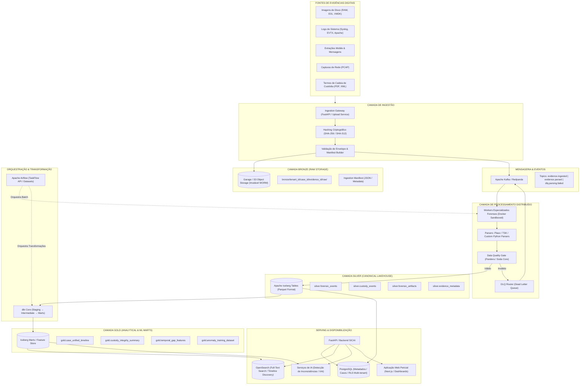

# 04 — Arquitetura de Referência da Plataforma de Dados

## 1. Visão Geral e Princípios Arquiteturais

A plataforma de Engenharia de Dados do SICAI foi concebida sob o paradigma **Lakehouse** com desacoplamento estrito entre **armazenamento** e **computação**, garantindo escalabilidade horizontal, auditabilidade nativa e interoperabilidade com ferramentas open-source [PROPOSTA].

### Princípios Norteadores:
1. **Imutabilidade da Evidência Bruta (WORM):** O dado original nunca sofre mutação in-place [FATO DO PROJETO].
2. **Open-Source First:** Adoção de componentes maduros e padrões abertos consolidados na indústria [FATO DO PROJETO].
3. **Auditabilidade e Linhagem Nativa:** Cada transformação gera metadados de proveniência rastreáveis da ingestão ao modelo de IA [FATO DO PROJETO].
4. **Idempotência Operacional:** Reexecuções de pipelines não geram efeitos colaterais nem registros duplicados [RECOMENDAÇÃO].

---

## 2. Diagrama Arquitetural de Referência



---

## 3. Detalhamento das Camadas do Lakehouse

### 3.1 Camada Bronze (Raw Data Vault)
* **Objetivo:** Preservar a evidência digital exatamente como recebida, com fidelidade bit a bit [FATO DO PROJETO].
* **Tecnologia:** Object Storage compatível com S3 (Garage para on-premise/desenvolvimento, AWS S3/Azure Blob para nuvem) [PROPOSTA].
* **Estrutura de Particionamento:**
  ```text
  s3://sicai-bronze/
    └── <tenant_id>/
        └── <case_id>/
            └── <evidence_id>/
                └── <ingestion_id>/
                    ├── raw/
                    │   └── original_payload.bin (ou .E01, .pcap, etc.)
                    ├── metadata/
                    │   └── source_envelope.json
                    └── manifest/
                        └── ingestion_manifest.json (SHA-256, SHA-512, headers)
  ```
* **Políticas de Governança:** Bloqueio de deleção e sobrescrita via Object Locking / WORM policies [RECOMENDAÇÃO].

### 3.2 Camada Silver (Modelo Canônico Normalizado)
* **Objetivo:** Estruturar, tipar, validar e unificar dados forenses heterogêneos em um esquema canônico comum [PROPOSTA].
* **Tecnologia:** **Apache Iceberg** sobre formato colunar **Apache Parquet**, com controle de snapshot e time-travel nativo [PROPOSTA].
* **Entidades Canônicas:**
  - `silver.forensic_events`: Eventos normalizados extraídos de sistemas operacionais, logs, mensagens e redes.
  - `silver.custody_events`: Ações de movimentação física e lógica da prova (as 10 etapas do CPP).
  - `silver.forensic_artifacts`: Metadados de arquivos, chaves de registro, processos e executáveis encontrados.
  - `silver.evidence_metadata`: Identificadores únicos, órgãos de apreensão, peritos responsáveis e certificados de custódia.
* **Mecanismos de Qualidade:** Todas as tabelas Silver são submetidas a validações estritas de esquema e integridade referencial via **Pandera** (em tempo de execução no worker) e **Soda Core** (pós-escrita) [RECOMENDAÇÃO].

### 3.3 Camada Gold (Marts Analíticos e Feature Store)
* **Objetivo:** Disponibilizar agregações consolidadas, reconstrução cronológica unificada e matrizes de features para consumo direto por modelos de Machine Learning e interfaces periciais [PROPOSTA].
* **Tecnologia:** Apache Iceberg / Parquet materializado via **dbt** [PROPOSTA].
* **Marts Principais:**
  - `gold.case_unified_timeline`: Linha do tempo unificada de todos os eventos forenses e de custódia de um processo criminal ou corporativo.
  - `gold.temporal_gap_features`: Indicadores de janelas de tempo sem registro de logs, atrasos anormais de custódia e quebras cronológicas.
  - `gold.anomaly_training_dataset`: Datasets rotulados e anonimizados para calibração contínua dos modelos de detecção de anomalias (TRL 4 e 5).

---

## 4. Pilha Tecnológica Selecionada e Justificativas

| Domínio | Tecnologia Selecionada [PROPOSTA] | Justificativa Técnica & Alinhamento com Skills |
| :--- | :--- | :--- |
| **Object Storage** | **Garage / S3** | Padrão da indústria S3 API, software open-source leve (Rust) ideal para auto-hospedagem (self-hosted), edge e on-premise resiliente, suporte a imutabilidade WORM e streaming de arquivos binários pesados. |
| **Table Format** | **Apache Iceberg** | Formato de tabela aberto, evolução de schema segura (in-place sem reescrever dados), suporte a Time Travel (essencial para reprodutibilidade pericial) e hidden partitioning. |
| **Formato de Arquivo** | **Apache Parquet** | Formato colunar de alta compressão (Snappy/ZSTD), ideal para leituras analíticas seletivas e projeção de colunas específicas em consultas forenses. |
| **Orquestração Batch** | **Apache Airflow** | Orquestrador open-source maduro; suporte nativo a DAGs orientadas a dados (Airflow Datasets), TaskFlow API, isolamento de operadores e agendamento robusto. |
| **Event Streaming** | **Apache Kafka** | Desacoplamento assíncrono entre a chegada da evidência, o disparo dos parsers pesados e as notificações de auditoria. |
| **Banco Relacional / OLTP**| **PostgreSQL** | Motor relacional robusto com suporte a Row-Level Security (RLS) para isolamento multi-tenant, tipos nativos JSONB e integridade referencial ACID estrita para dados de gestão pericial. |
| **Motor de Busca / Serving**| **OpenSearch** | Indexação full-text de logs, metadados forenses e artefatos textuais com capacidade de agregação facetada e busca em tempo real para dashboards periciais. |
| **Transformação Lakehouse**| **dbt Core** | Engenharia analítica modular (staging, intermediate, marts), enforcement de data contracts, testes automáticos de integridade e documentação integrada. |
| **Data Quality & Validação**| **Soda Core + Pandera**| Pandera para validação in-flight no runtime do Python Worker; Soda Core para validação declarativa de integridade referencial e detecção de anomalias temporais no Lakehouse. |
| **Data Lineage** | **OpenLineage + Marquez** | Padrão aberto para captura de metadados de execução e linhagem de dados operacional ponta a ponta. |
